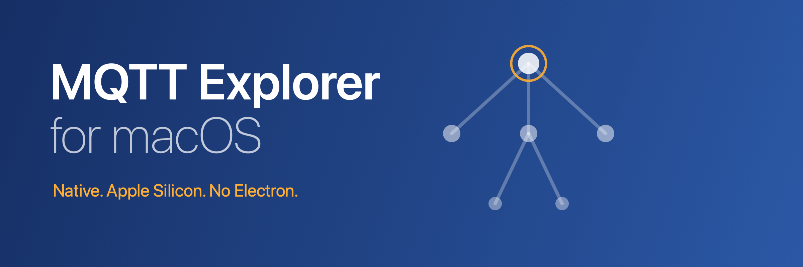

[](https://github.com/SheetMetalConnect/MQTT-Explorer-MacOS/releases/latest)
[](LICENSE.md)

[MQTT Explorer](https://mqtt-explorer.com) rebuilt in Swift and SwiftUI for
Apple Silicon.

## Install

Download the DMG from the
[releases page](https://github.com/SheetMetalConnect/MQTT-Explorer-MacOS/releases/latest)
and drag it to Applications. Signed ad-hoc, not notarized, so the first
launch needs right-click, Open, confirm.

## Changed from the original

**Rewritten**
- Swift and SwiftUI instead of Electron, arm64 only
- 5 MB download instead of 90 MB
- System light and dark mode, native controls

**Added**
- Value mode: numbers charted automatically. Scalars get a trend plot, JSON
  objects a sparkline and share ring per field, arrays a bar chart
- Chart every value on a topic and its children with one button
- JSON as a field table with dot paths and per-field chart buttons
- Payload type markers in the tree: `{}` `[]` `#` `Aa` `hex`
- UNS data contracts (`_historian`, `_process`) tinted in the tree
- Live values table per branch: what changed, when, how often
- Session log, and JSON export or import of connections
- Auto-expand by branch width and by depth, separately
- Topic and message counters in the status bar

**Layout**
- Three columns: tree, details, charts. Charts moved off the bottom left
- One status bar for last message, QoS and retained state
- Settings split into General, Broker and Diagnostics

**Performance**
- Tree merged in an actor off the main thread, wire order preserved
- Row list is lazy and only rebuilds when the visible set changes
- Topics capped at 100k, dropped messages reported
- Auto-expand stops above 5k topics, Expand All above 8k

**[Not ported](docs/differences-from-upstream.md#not-ported)**
- Sparkplug B decoding, planned
- Last will messages, planned
- The AI assistant, not planned
- Windows and Linux, use the original

## Build

macOS 15 or newer, Xcode 26 or matching command line tools.

```sh
cd macos
./make-dmg.sh
swift test
```

## Docs

- [Usage](docs/usage.md)
- [Full comparison with the original](docs/differences-from-upstream.md)

## License

CC BY-ND 4.0, same as the original. See `LICENSE.md`.

Original MQTT Explorer by Thomas Nordquist. macOS version by Luke van
Enkhuizen. Issues go
[here](https://github.com/SheetMetalConnect/MQTT-Explorer-MacOS/issues).
